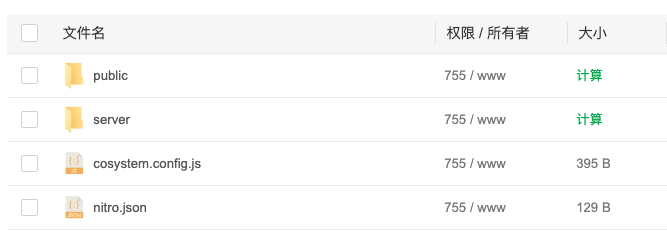

# 本地Mac环境

```
npm -version
9.5.1
node -v  
v18.16.0
```

```js
{
  "devDependencies": {
    "@css-render/vue3-ssr": "^0.15.12",
    "@types/node": "^18",
    "@vicons/ionicons5": "^0.12.0",
    "naive-ui": "^2.34.3",
    "nuxt": "^3.5.0",
    "nuxt-windicss": "^2.6.1"
  },
  "dependencies": {
    "qrcode": "^1.5.1"
  }
}
```


# defineExpose问题

当想在自定义组件中向外暴露方法时，如果组件加载时就有await网络请求，需要将defineExpose定义写在wait网络请求前面，否则调用的时候会找不到handlePageChange

```js
const handlePageChange = (p) => {
    page.value = p
    refresh()
}

defineExpose({
    handlePageChange
})

let { data, pending, error, refresh, rows, total } = await usePage(() => {
        return usePostCommentList(() => {
            return {
                page: page.value,
                limit: pageSize.value,
                post_id: props.post_id
            }
        })
}, 10)
```

错误信息如下：

```js
[id].vue:116 Uncaught (in promise) TypeError: CommentRef.value.handlePageChange is not a function
    at handleCommentSuccess ([id].vue:116:22)
    at callWithErrorHandling (chunk-FHPNLUPZ.js:213:18)
    at callWithAsyncErrorHandling (chunk-FHPNLUPZ.js:221:17)
    at emit (chunk-FHPNLUPZ.js:722:5)
    at chunk-FHPNLUPZ.js:7465:45
    at CommentInput.vue:85:9
```


# Naive-ui中n-select问题

在form表单中对n-select校验时

```html
<n-form ref="formRef" :model="form" :rules="rules" :show-label="false">

	<n-form-item path="bbs_id">
		<n-select v-model:value="form.bbs_id" :options="options" placeholder="请选择主题" class="bg-white" />
	</n-form-item>
</n-form>
```
规则中不能添加trigger，否则校验一直会失败
```js
const rules = {
    // select校验不能添加trigger,否则校验失败
    bbs_id: [{
        required: true,
        message: "请选择社区",
        // trigger: ['blur', 'change']
    }]
}
```

# Naive-ui中n-form问题

当form表单中不需要lable的时候，需要显示的设置show-label为false，这样可以减少n-form-item之间的间距

```js
<n-form :show-label="false">
  <n-form-item>
  </n-form-item>
</n-form>
```


# 组件中网路请求

n-form表单中的input组件在提交使用网络请求是要使用$fetch，不能使用useFetch，如果使用useFetch当请求是否后，在input中输入任何内容，会莫名其妙的自动触发网络请求，很奇怪。


# 部署步骤

## **宝塔nginx**

安装路径：

```js
/www/server/nginx
```

配置文件路径：

```
/www/server/nginx/conf/nginx.conf
```

nginx.conf中会加载如下路径中所有.conf文件

```
include /www/server/panel/vhost/nginx/*.conf;
```


## 部署

### 本地编译工程

nuxt.config.ts文件中添加如下配置

```js
export default defineNuxtConfig({
    nitro:{
        // 缩小捆绑包
        minify:true,
        // 关闭源映射生成
        sourceMap:false
    }
})
```

然后执行如下命令

</img>

会在工程中编译生成.output目录。

### 服务器操作

官网部署参考：https://nuxt.com/docs/getting-started/deployment

Linux环境

```
[root@VM-0-10-centos edu-front]# npm -version
8.1.0
[root@VM-0-10-centos edu-front]# node -v
v16.13.0
[root@VM-0-10-centos edu-front]# 
```


首先开启服务器的端口3000（因为nuxt3默认是3000端口）

然后在服务器的/www/wwwroot/创建一个目录，然后压缩.output目录、上传、然后解压

</img>

然后创建cosystem.config.js文件，内容如下

```js
module.exports = {
  apps: [
    {
      name: 'nuxtApp',  // 设置启动项目名称
      exec_mode: 'cluster',
      instances: 'max',
      // 注意这里的相对路径。要访问到index.mjs就行了，如果你是整个.output一起放在服务器的话就和官方一样路写成./.output/server/index.mjs就好了
      script: './server/index.mjs'
    }
  ]
}
```
最后通过如下命令启动（服务器需要安装pm2）

```js
# 启动网页服务
pm2 start ecosystem.config.js
# 然后使用下边的命令看一下启动的服务列表
pm2 list
```

